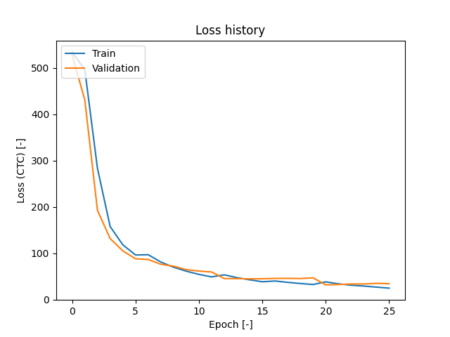
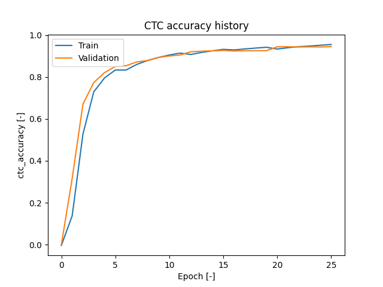

# Speech to Text v2

## Short description
My another version of TTS, this time with web app and api, trained using <a href="https://www.tensorflow.org/datasets/catalog/librispeech" target="_blank">LibriSpeech</a>.

It's made of 3 components:
 - **TTS module**
 - **api**
 - **webapp**

[](https://www.youtube.com/watch?v=HHr6DroYgn4)

## Setup
  - ```pip install -r requirements.txt```

## Packages
```
fastapi==0.115.5
Flask==3.1.0
flask_wtf==1.2.2
numpy==1.26.0
pandas==2.0.2
Pillow==10.3.0
pydantic==2.12.5
python-dotenv==1.0.1
Requests==2.32.3
scikit_learn==1.7.2
tensorflow==2.17.0
tensorflow_intel==2.17.0
uvicorn==0.32.0
librosa==0.11.0
WTForms==3.2.1
```

## Project Structure
```
│   config.py
│   custom_decorators.py
│   custom_logger.py
│   README.md
│   requirements.txt
│   tools.py
│   speech_text.py
├───api/
│   ├───__init__.py
│   ├───routes.py
│   ├───run.py
│   └───uvicorn_log_config.json
├───audio_files/
├───logs/
├───models/
├───ocr_webapp/
│   ├───__init__.py
│   ├───.env
│   ├───delete_temp_files.py
│   ├───forms.py
│   ├───routes.py
│   ├───run.py
│   ├───static/
│   │   ├───images/
│   │   ├───styles/
│   │   └───temp_uploads/
│   └───templates/
```

## Model Architecture

### 1. Model Input
* **Shape**: The model accepts a 2D spectrogram as input, represented as `(time_steps, frequency_bins)`, where each time step corresponds to a time frame, and each frequency bin represents spectral information at that frame.
* **Layer**: `input_spectrogram` serves as the input layer, handling spectrograms with variable time steps (`None` in the time dimension).

### 2. Expand Dimensions for 2D Convolutional Layers
* **Reshape Layer**: `layers.Reshape` expands the input to `(time_steps, frequency_bins, 1)` to allow 2D convolutional processing (adding channel dimension).

### 3. Convolutional Layers
The model applies three 2D convolutional layers to extract features from the spectrogram.
* **Conv Layer 1**:
   * Filters: 32
   * Kernel Size: `[11, 41]`
   * Strides: `[2, 2]` (reduces the input size in both time and frequency dimensions)
   * Activation: `ReLU`
   * Normalization: Batch normalization applied after convolution.
* **Conv Layer 2**:
   * Filters: 32
   * Kernel Size: `[11, 21]`
   * Strides: `[1, 2]`
   * Activation: `ReLU`
   * Normalization: Batch normalization applied after convolution.
* **Conv Layer 3**:
   * Filters: 64
   * Kernel Size: `[11, 11]`
   * Strides: `[1, 2]`
   * Activation: `ReLU`
   * Normalization: Batch normalization applied after convolution.

### 4. Post CNN reshape 
After the convolutional layers, the output is reshaped to a sequence format to feed into the recurrent layers. Frequencies and channels are flattened into a single dimension of features. Convolution layers extract features which helps with ignoring irrelevant patterns or noise in the spectrogram, so model can focus on speech.

### 5. Bidirectional LSTM Layers
The model uses stacked bidirectional LSTM (Long Short-Term Memory) layers, it's task is to process sequentially encoded acoustic features.
* **LSTM Layers**:
   * Number of Layers: `rnn_layers` (specified as a hyperparameter - 4)
   * Units per Layer: `rnn_units` (256)
   * Direction: Bidirectional (processes the sequence forwards and backwards)
   * Dropout: Applied between LSTM layers to prevent overfitting

### 6. Fully connected layer
* A Dense layer (`dense_1`) is used to further process the output of the recurrent layers.
   * Units: `rnn_units * 2` - 2 times because it's using bidirectional, so 2 directions (forward + backward)
   * Activation: `ReLU`
   * Dropout: Applied after this layer for additional regularization

### 7. Output Layer
* The final output layer is a fully connected layer with `output_dim + 1` units, where each unit represents a character or a blank symbol (for CTC loss).
* **Activation**: `softmax`, which converts the output to a probability distribution over possible characters.

### 8. Optimizer
Adam optimizer with learning rate schedule (**CosineDecay**):

 - **initial_learning_rate**: 1e-3
 - **decay_steps**:  EPOCHS * steps_per_epoch (``len(df_train) // BATCH_SIZE``)
 - **alpha**: 1e-5

### 9. CTC Loss Function
Used to solve the problem of unaligned inputs and outputs. It is particularly useful in speech recognition, image-to-text transcription (OCR) and other sequence processing model

 - **How does CTC Loss work?** <br>
Independence of input and output length: In many cases, the length of the input sequence (e.g., the number of frames in an audio recording) differs from the length of the expected output sequence (e.g., the number of characters in a transcription). CTC is designed to handle this problem.

- **Inserting a “blank” symbol**: <br>
 CTC uses an additional blank symbol (meaning “no character”) to help deal with the situation when the model does not predict a new character in each input frame. Blank symbols allow the model to differentiate between adjacent characters and ignore redundant predictions.

- **Different matches (alignment)**: <br>
CTC calculates the probability of different possible matches between the input sequence and the output sequence. For example, for an input audio signal that corresponds to the output “HELLO,” the model can generate multiple combinations (e.g., “H_E_LL_O_” where “_” is a blank) that will be interpreted as correct transcriptions.

In sequential tasks like speech recognition, the length of the input (e.g., the number of audio frames) is variable, as is the length of the output (e.g., the number of words or characters in a transcription). CTCLoss is designed specifically to deal with this variability in length, allowing for different input to output matches and inserting blank symbols in the appropriate place

## About dataset
Libri Speech is a popular dataset for TTS models, it contains 1000 hours of English speech with sampling rate of 16 kHz. In my project I used `train-clean-100` version which contains 28,539 of examples. 

Source:
 - https://www.tensorflow.org/datasets/catalog/librispeech

## Training
Model was trained oc Google Colab with GPU, after 26 epochs training has been stopped because model slowly started to overfit, so the final metrics are:
 - **Loss**: 24.68
 - **Val Loss**: 34.16
 - **CTC accuracy**: 0.95
 - **Val CTC accuracy**: 0.945
 - **WER (Word Error Rate)**: 0.2157 (21%)
 - **CER (Character Error Rate)**: 0.0658 (6%)

 

 


## Configuration
Configuration sits in the `config.py` file.

The most important settings:

#### Model
 - FRAME_LENGTH: `int` - related to spectrogram, leave as is
 - FRAME_STEP: `int` - related to spectrogram, leave as is
 - FFT_LENGTH: `int` - related to spectrogram, leave as is
 - MODEL_FOLDER: `str` - path to the model folder, should contant `.h5` model file and mappings files named: `char_to_num.pkl` and `num_to_char.pkl` 

#### Web App
 - WEB_APP_PORT: `int`
 - WEB_APP_HOST: `str`
 - WEB_APP_DEBUG: `bool`
 - WEB_APP_LOG_FILE: `str`
 - WEB_APP_TEMP_UPLOADS_FOLDER: `str`
 - WEB_APP_FILES_LIFE_TIME: `int`
 - WEB_APP_USE_SSL: `bool`
 - WEB_APP_PROTOCOL: `str`
 - WEB_APP_API_TIMEOUT: `int`

#### API
- API_PORT: `int`
- API_HOST: `str`
- API_LOG_FILE: `str`
- MAX_IMAGE_FILES: `int`
- API_MAX_FILE_SIZE_MB: `int`
- API_PROTOCOL: `str`
- API_ALLOWED_EXTENSIONS: `set`
- API_CHECK_INTERVAL: `int`


## TTS module
TTS module sits in `speech_to_text.py` file.

#### Class parameters
- model_folder: `Union[str, Path]`
- frame_length: `int` = Config.FRAME_LENGTH
- frame_step: `int` = Config.FRAME_STEP
- fft_length: `int` = Config.FFT_LENGTH

#### On init
On initialization, loads model and `num_to_char` mapping.
#### Methods

`load_and_process_audio` - loads audio input, which can be provided as: file path or bytes. Method has `normalize` option to make sure audio will be loaded in 16 kHz sample rate and it also allows you to read more file formats. Processing might take more time but it can be used to make sure everything is correct.

**Parameters**
- audio_input: `Union[str, bytes, BytesIO]`
- target_sample_rate: `int` = 16000

**Returns**

Spectorgram as `np.ndarray`.


`normalize_audio` - method for normalizing audio, handles more audio forms and loads it in 16 kHz sample rate.

**Parameters**
- audio_input: `Union[str, bytes, BytesIO]`
- target_sample_rate: `int` = 16000

**Returns**

Audio as `np.ndarray`.


`decode_prediction` - method used for decoding predictions, CTC decode and converting to text.

**Parameters**
- pred: `np.ndarray`

**Returns**

Single transcription as `str`.

`transcribe` - main method for getting transcriptions, it handles multiple inputs.

**Parameters**
- audio_input: `List[Union[str, bytes, BytesIO]]`
-  normalize: `bool` = False

**Returns**

All transcriptions as `List[str]`


